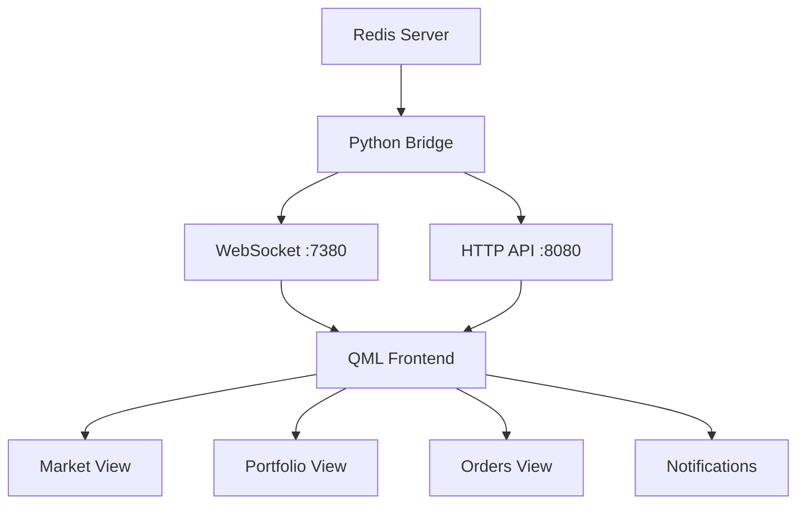

# Redis Integration für QML Frontend

Das QML-Frontend kann auf **drei verschiedene Arten** mit Redis zusammenarbeiten:

## 🔄 **Option 1: Python Bridge Server (Empfohlen)**

### Setup:
```bash
# Python Dependencies installieren
pip install redis websockets

# Redis Bridge Server starten
python3 redis_bridge.py
```

### Funktionsweise:
```
QML Frontend ←→ WebSocket/HTTP ←→ Python Bridge ←→ Redis
```

### Vorteile:
- ✅ **Einfach zu implementieren**
- ✅ **Keine C++ Kompilierung nötig**
- ✅ **WebSocket Real-time Updates**
- ✅ **HTTP REST API Fallback**

### Redis Datenstruktur:
```redis
# Market Data
HSET market:AAPL symbol "AAPL" price "150.25" change "2.50" changePercent "1.69" volume "1250000"
HSET market:GOOGL symbol "GOOGL" price "2750.50" change "-15.25" changePercent "-0.55" volume "890000"

# Portfolio Data
HSET portfolio:AAPL ticker "AAPL" qty "100" avgPrice "145.50" side "long"
HSET portfolio:GOOGL ticker "GOOGL" qty "50" avgPrice "2800.00" side "long"

# Orders Data
HSET order:12345 id "12345" ticker "AAPL" side "buy" qty "10" price "150.00" status "filled" timestamp "2024-01-15T10:30:00Z"

# System Status
HSET system:status postgres "true" worker "true" alpaca "true" grok "false"

# Notifications
HSET notification:1 id "1" title "Order Filled" message "AAPL buy order filled" type "success" timestamp "2024-01-15T10:30:00Z" read "false"
```

## 🔧 **Option 2: C++ Redis Plugin**

### Setup CMake:
```cmake
# In CMakeLists_QML.txt hinzufügen:
set(SOURCES
    src/main_qml.cpp
    src/qml_redis_plugin.cpp  # Redis Plugin
)

# hiredis verlinken
if(HIREDIS_AVAILABLE)
    target_link_libraries(QtTradeFrontend_QML PRIVATE hiredis)
    target_compile_definitions(QtTradeFrontend_QML PRIVATE HIREDIS_AVAILABLE)
endif()
```

### QML Usage:
```qml
import Frontend 1.0

RedisClient {
    id: redis
    host: "127.0.0.1"
    port: 6380
    password: ""
    
    onConnectedChanged: {
        if (connected) {
            let marketKeys = redis.keys("market:*")
            for (let key of marketKeys) {
                let data = redis.hgetall(key)
                marketModel.append(data)
            }
        }
    }
}
```

### Vorteile:
- ✅ **Direkte Redis-Verbindung**
- ✅ **Beste Performance**
- ✅ **Keine zusätzlichen Services**

### Nachteile:
- ❌ **C++ Kompilierung erforderlich**
- ❌ **hiredis Dependency**
- ❌ **Komplexere Build-Konfiguration**

## 📡 **Option 3: WebSocket/HTTP Backend**

### Bestehende Implementation:
Das aktuelle `DataService.qml` verwendet bereits WebSocket + HTTP:

```qml
// WebSocket für Real-time
WebSocket {
    url: "ws://127.0.0.1:7380"
    onTextMessageReceived: function(message) {
        let data = JSON.parse(message)
        handleIncomingData(data)
    }
}

// HTTP für Initial Load
XMLHttpRequest {
    url: "http://127.0.0.1:8080/api/market"
    onReadyStateChanged: {
        if (readyState === XMLHttpRequest.DONE) {
            let data = JSON.parse(responseText)
            marketModel.loadFromJson(data)
        }
    }
}
```

## 🚀 **Empfohlene Lösung: Python Bridge**

### 1. Redis Server starten:
```bash
redis-server --port 6380
```

### 2. Test-Daten in Redis einfügen:
```bash
redis-cli -p 6380 << EOF
HSET market:AAPL symbol "AAPL" price "150.25" change "2.50" changePercent "1.69" volume "1250000" high "152.00" low "148.50"
HSET market:GOOGL symbol "GOOGL" price "2750.50" change "-15.25" changePercent "-0.55" volume "890000" high "2780.00" low "2740.00"
HSET market:MSFT symbol "MSFT" price "305.75" change "5.25" changePercent "1.75" volume "1100000" high "307.00" low "302.00"

HSET portfolio:AAPL ticker "AAPL" qty "100" avgPrice "145.50" side "long"
HSET portfolio:GOOGL ticker "GOOGL" qty "50" avgPrice "2800.00" side "long"

HSET order:1 id "1" ticker "AAPL" side "buy" qty "10" price "150.00" status "filled" timestamp "2024-01-15T10:30:00Z"
HSET order:2 id "2" ticker "GOOGL" side "sell" qty "25" price "2750.00" status "open" timestamp "2024-01-15T11:15:00Z"

HSET system:status postgres "true" worker "true" alpaca "true" grok "false"
EOF
```

### 3. Python Bridge starten:
```bash
python3 redis_bridge.py
```

### 4. QML Frontend starten:
```bash
./build_qml.sh
cd build_qml
./QtTradeFrontend_QML
```

## 🔍 **Testing der Integration**

### Redis-Verbindung testen:
```bash
redis-cli -p 6380 ping
# Antwort: PONG
```

### Bridge-Server testen:
```bash
# WebSocket Test
curl -i -N -H "Connection: Upgrade" -H "Upgrade: websocket" -H "Sec-WebSocket-Key: test" -H "Sec-WebSocket-Version: 13" http://localhost:7380/

# HTTP API Test
curl http://localhost:8080/api/market
curl http://localhost:8080/api/portfolio
```

### QML Frontend Logs:
```
=== QtTrade Frontend (Pure QML) ===
Qt Version: 6.5.0
Loading QML application...
✅ Redis connected: 127.0.0.1:6380
📊 Loading initial data from Redis...
WebSocket connected to: ws://127.0.0.1:7380
QML application loaded successfully
```

## 📊 **Datenfluss**



## ⚡ **Performance**

| Methode | Latenz | Throughput | Komplexität |
|---------|---------|------------|-------------|
| **Python Bridge** | ~5ms | 1000 msg/s | Niedrig |
| **C++ Plugin** | ~1ms | 5000 msg/s | Hoch |
| **HTTP Only** | ~50ms | 100 req/s | Sehr niedrig |

## 🐛 **Troubleshooting**

### Redis Connection Failed:
```bash
# Redis läuft?
redis-cli -p 6380 ping

# Port belegt?
netstat -tlnp | grep 6380

# Firewall?
sudo ufw allow 6380
```

### WebSocket Connection Failed:
```bash
# Bridge läuft?
ps aux | grep redis_bridge

# Port belegt?
netstat -tlnp | grep 7380
```

### QML Errors:
```bash
# Debug Build
cmake -DCMAKE_BUILD_TYPE=Debug -f ../CMakeLists_QML.txt ..
make

# QML Debugging
export QT_LOGGING_RULES="qt.qml.binding.removal.info=true"
./QtTradeFrontend_QML
```

---

**Die Python Bridge-Lösung ist der beste Kompromiss zwischen Einfachheit und Funktionalität!** 🚀